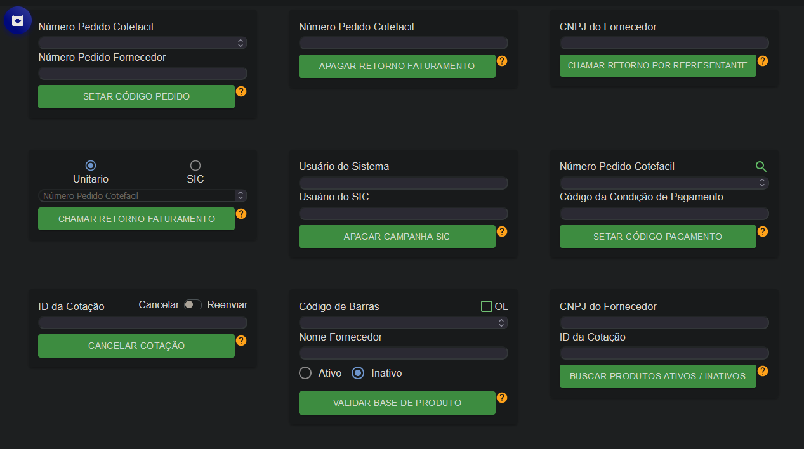
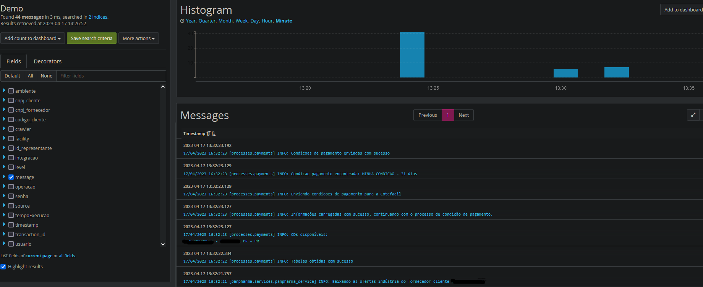

# Automações - Cotefácil !

Aqui estão meus projetos de automação, pensados e desenvolvidos para facilitar os testes, processos e trabalho no geral dos times.

## Instalação

Apenas clone o repo e instale as dependências.

```bash
git clone https://github.com/Direnzii/automacoes_py_cotefacil.git
```

## Uso

Da utilidade das automações, estão entre elas...

```python
- Converter arquivos em arquivos de falta (usado internamente no sistema)

- Automação completa dos processos da ferramenta do suporte
(usada para reenvio de cotação, retorno de faturamento, entre outros)

- Liberação de fornecedor na plataforma

- Reenvio de cotação mais específica pelo monitoramento

- Validação de logs e report em planilha
```

Tela principal de uma das ferramentas !

Exemplo de dados utilizados nas automações, Graylog

